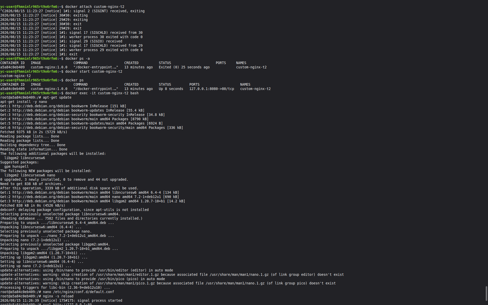
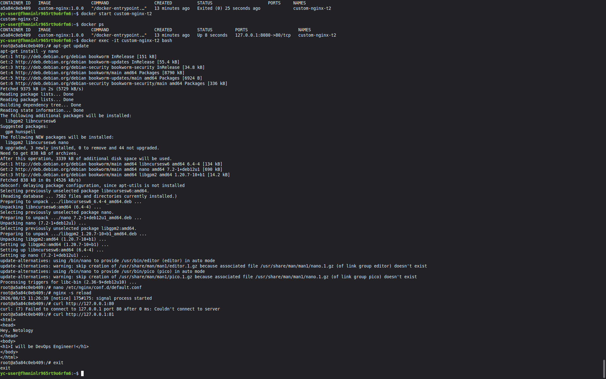
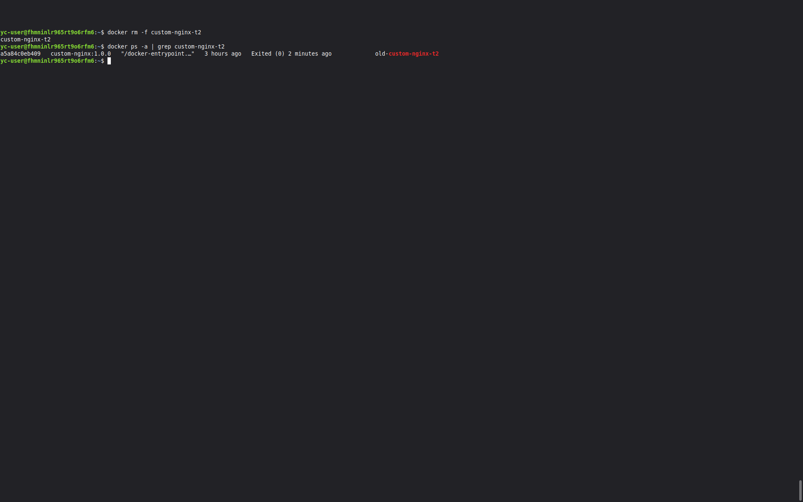
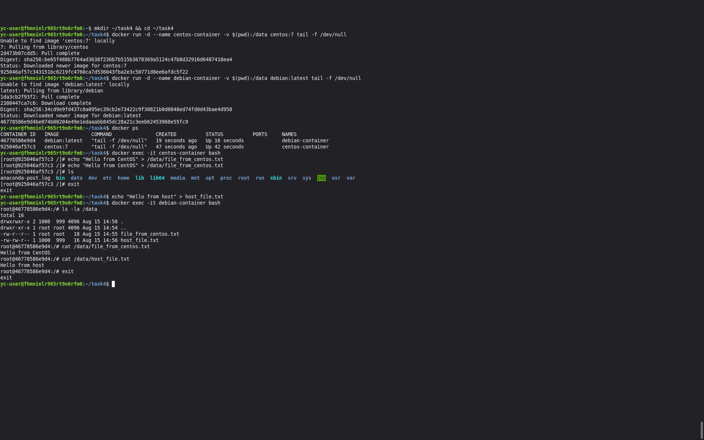
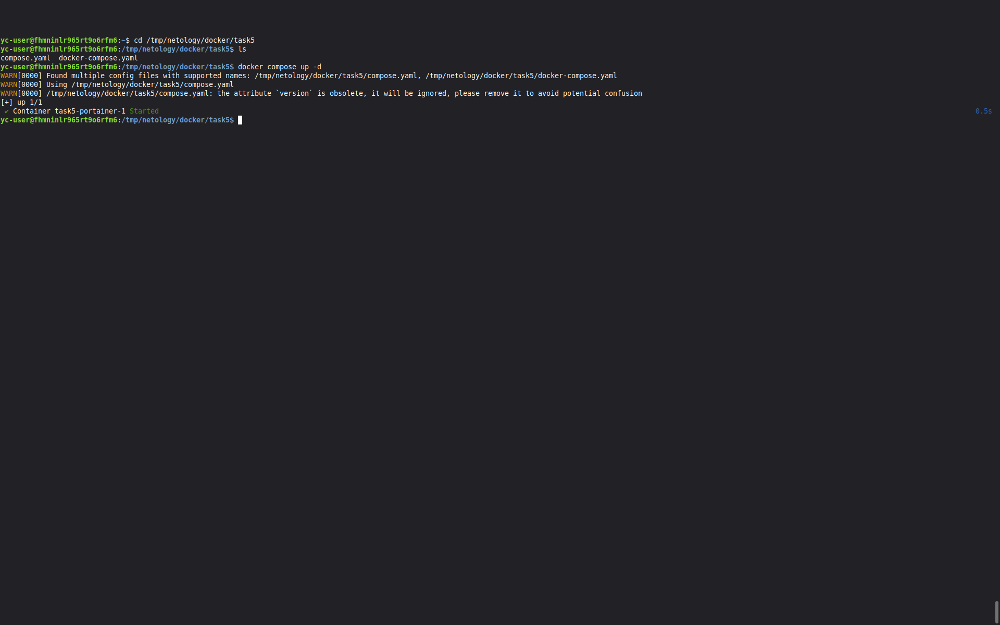
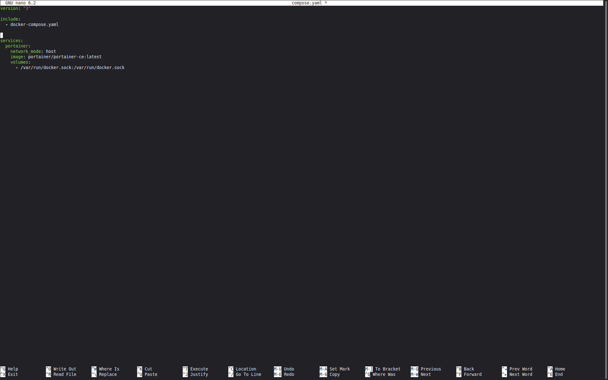
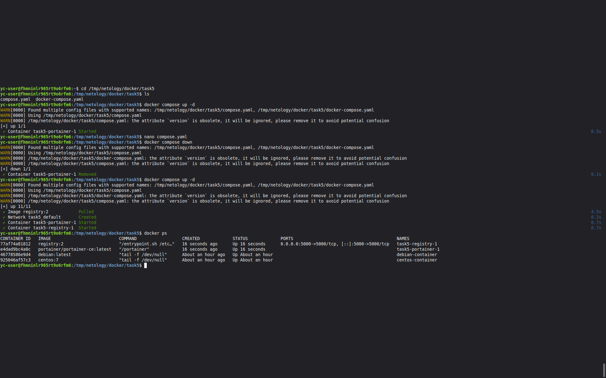
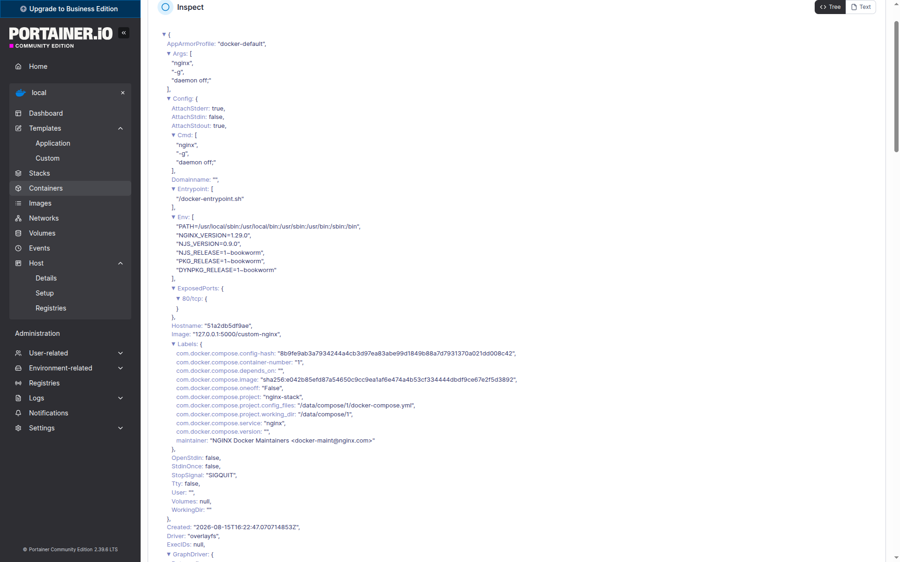
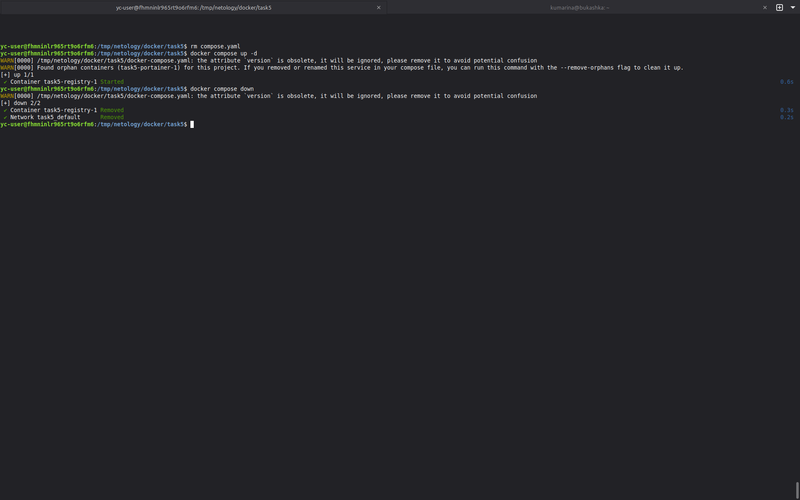

# Docker-Container-Orchestration-with-Docker-Compose Марина Кукушкина

## Задание 1
https://hub.docker.com/repository/docker/kumarina/custom-nginx/general 

## Задание 2

## Задание 3

### Ответ на вопрос по пункту 3: 
Контейнер остановился, потому что нажатие Ctrl+C в docker attach отправило сигнал прерывания главному процессу (nginx), и он завершил свою работу. Так как в контейнере не было других процессов, контейнер перешёл в состояние Exited.

### Ответ на вопрос пункта 10:

При создании контейнера я указала Docker, чтобы все запросы на порт 8080 хоста отправлялись внутрь контейнера на порт 80. Внутри контейнера nginx по умолчанию слушал порт 80 – всё работало. Но потом я поменяла настройки nginx, сказав ему слушать порт 81 вместо 80. Теперь запросы приходят на порт 80 (через проброс 8080→80), а там никто не отвечает – nginx слушает только 81. Поэтому curl получает ошибку «Connection refused». Проброс портов остался старым (8080→80), и его нельзя изменить без пересоздания контейнера – вот почему доступ пропал.
### Удаление запущенного контейнера "custom-nginx-t2", не останавливая его

## Задание 4

## Задание 5

### Отредактированный файл compose.yaml так, чтобы были запущенны оба файла. 

### Удаление compose.yaml и выполнение docker compose up -d с предупреждением. Команда docker compose down (погасить проект).

